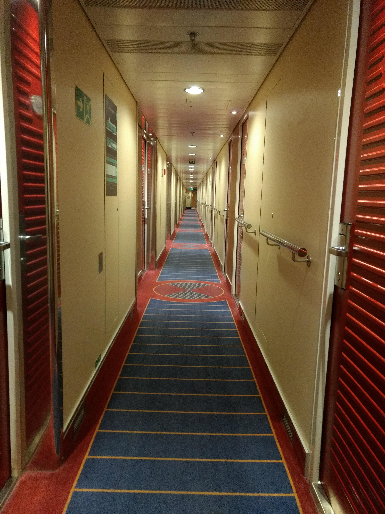
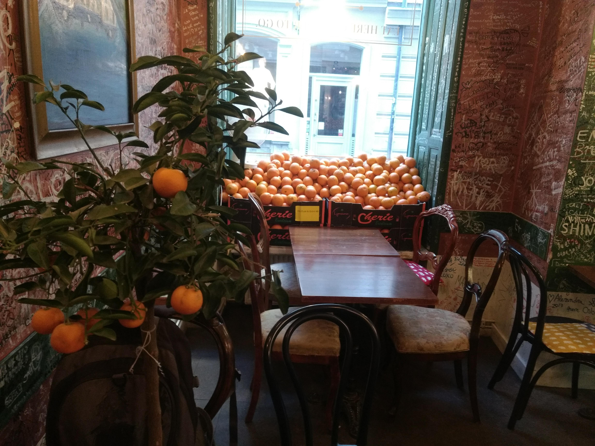
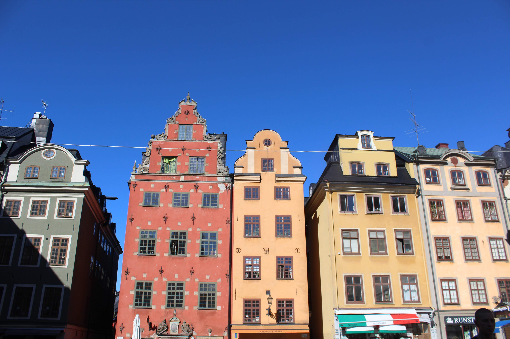
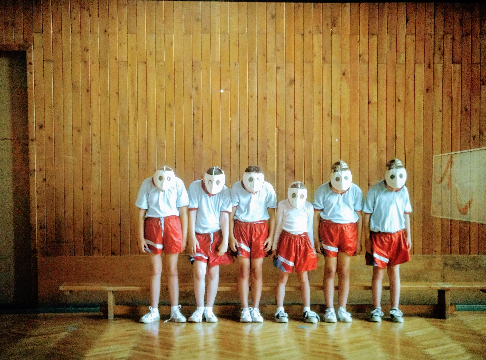
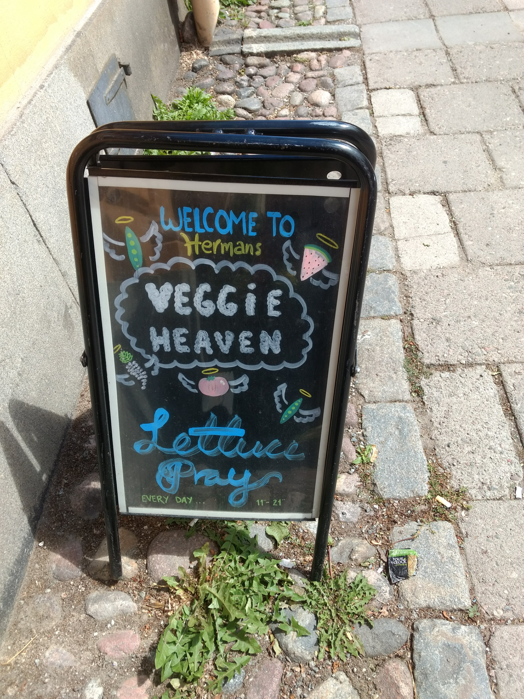
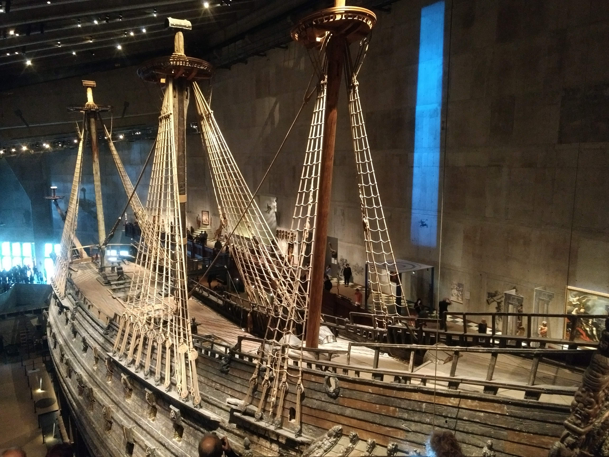
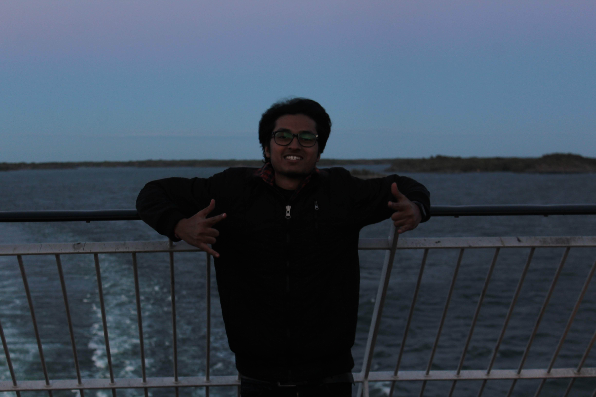

This is about a Finnish guy (let's call him Mr X) and one of his endeavours.

One bright night (Finnish nights in summers), he decided to plan a voyage to Stockholm. After successfully completing the journey, one of his friends got so excited that he decided to write a blog.

### Overnight cruise from Turku to Stockholm

**Mr X**: 'There are several ferries from Turku, the only difference being that the overnight ferries are a bit expensive but they are more entertaining.'

From our bits and pieces of experience, we knew that Finns get super crazy when they are drunk. So we booked a cabin in Baltic Princess (Tallink - Silja Line) which started from Port of Turku at 20:00.

The overnight cruise offered various activities/ services like Entertainment and Shows, Shopping (including Tax Free), Refreshing Sauna (Mr X couldn't stop thinking about this), and ofcourse Restaurants (lots of vegan options as well). We also bought the travel cards for 12€ which could be used for 24 hours in Stockholm.
{:class="img-responsive"}

Just like for every delta there exists an epsilon, for every X there exists a Y.  
Ms Y was enlivened not because it was her first cruise but because of the sheer size of menu in the New Grande Buffet.

The cruise had enough options to keep us engaged thoughout the night. Imagine dancing until dawn in the middle of Baltic Sea. Insane! The most adventurous part was climbing onto the open deck of the ship and experiencing gale-like winds.

And if none of this seem exciting, watch Tobey Maguire shoot spider-webs from the super-comfortable cabins!

### Stockholm

Ms Y checked the time on her MiBand at Värtahamnen, "Shoot! It's 06:30 we have like 12 hours and I'm hungry."  
We took a metro to Gamla Stan.

1. **Breakfast at Café Schweizer**  
Most of the city shops remain closed until 10 or 11. Luckily we found this super cool café open. Mr X and Ms Y vandalized the walls of the café in front of 6 policemen!
{:class="img-responsive"}

2. **Stortorget**  
Surrounded by iconic buildings, the square was the site of the Stockholm Bloodbath, where Swedish noblemen were massacred by the Danish King Christian II in November, 1520. Both Mr X and Ms Y were quite amazed by the Stockholm Cathedral, Nobel Museum, Nobel Library, numbered buildings and the well.
{:class="img-responsive"}

3. **Fotografiska**  
Metro to Slussen and a few metres of walk led us to this center of contemporary photography. Ms Y wished she had her psychedelic senses triggered!
{:class="img-responsive"}

4. **Stockholm View**  
It was 10 min walk from Fotofrafiska to Hermans. But that meant climbing a bridge but the reward was this:
{:class="img-responsive"}

5. **Lunch at Hermans**  
After that breathtaking view we continued to Hermans for a vegan buffet.  
Pro advice: keep student ID all the time. Ms Y regrets this!
{:class="img-responsive"}

6. **Vasa Museum**  
Best Viking era experience with the Swedish warship that has been preserved since the 17th century!
{:class="img-responsive"}

7. **The Royal Palace**  
The official residence of the King of Sweden and it's open to the public. There are 4 or 5 museums and it's quite interesting to watch the parade of soldiers and daily changing of the guard.
{:class="img-responsive"}

### Overnight cruise from Stockholm to Turku

Pretty much the same cruise experience. Everyone was back to Turku in Galaxy at 06:30 in the morning with lots of chocolates, pictures and memories!
{:class="img-responsive"}

Thank you for reading the blog. Get in touch if you have any questions.

